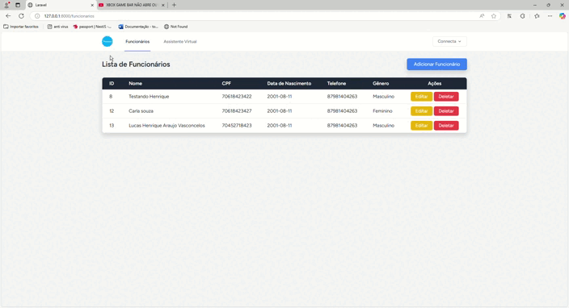
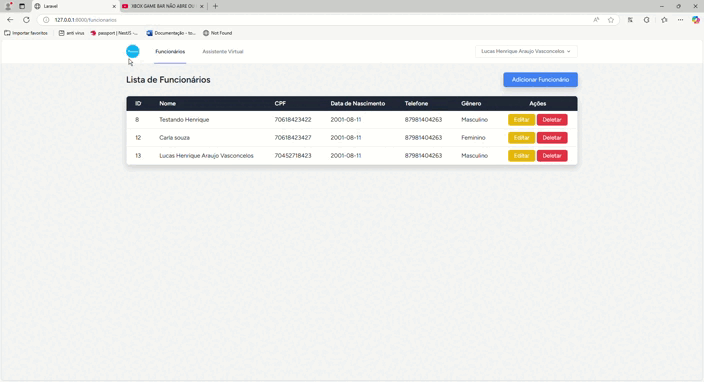

# CRUD de funcionarios e Assistente Jurídico (Adicional) com Laravel e ChatGPT

Este é um projeto Laravel que implementa um CRUD de funcionarios e assistente jurídico virtual utilizando API do ChatGPT para responder consultas legais. As tecnologias usadas foram: Laravel, Blade, Tailwind, Laravel Breeze, MySql e API Open IA ChatGPT. 

## Pré-requisitos

Antes de começar, certifique-se de ter os seguintes requisitos instalados:

- PHP 8.1 ou superior
- Composer
- MySQL
- Node.js e npm/yarn (para o frontend)
- OpenAI API Key

## Instalação

Siga estas etapas para rodar o projeto localmente:

### 1. Clone o Repositório
git clone https://github.com/seu-usuario/seu-repositorio.git
cd seu-repositorio

### 2. Instale as Dependências do PHP
bash: composer install

### 3. Instale as Dependências do Node.js
bash: npm install ou yarn install

### 4. Configure o Arquivo .env
Faça o arquivo .env no seu projeto, copie todo o arquivo .env.example e cole no .env

Edite o arquivo .env com suas configurações:
DB_CONNECTION=mysql
DB_HOST=127.0.0.1
DB_PORT=3306
DB_DATABASE=nome_do_banco
DB_USERNAME=seu_usuario
DB_PASSWORD=sua_senha

Troque todos os dados para o seu banco de dados.

Chave da API do OpenAI:
As chaves da OpenAI podem deixar as que estão no .env.example já estão configuradas para serem usadas.

### 5. Gere a Chave do Aplicativo
bash: php artisan key:generate

### 6. Configure o Banco de Dados
bash: php artisan migrate

Utilize esse comando para fazer as migrations no banco de dados.

### 7. Execute o Servidor de Desenvolvimento
bash: php artisan serve

### 8. Execute o frontend
bash: npm run dev ou yarn dev

## Demonstração CRUD

## Demonstração Assistente

